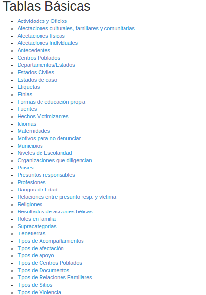
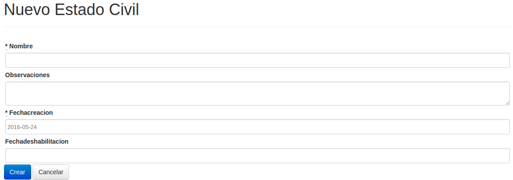
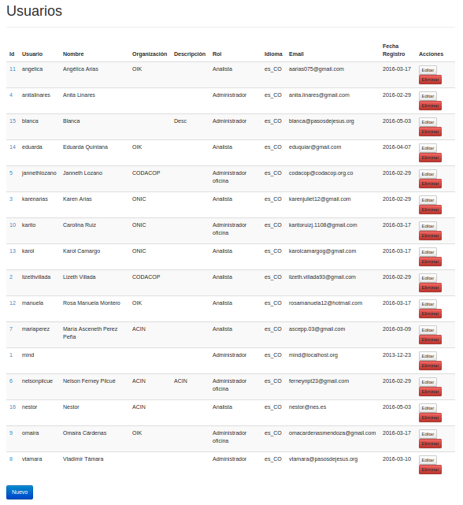

 
# Administración {#administracion}

**Logros**

* Añade y elimina registros a tablas básicas.

* Puede hacer volcados de la base de datos y sacar copias de forma segura.

Un usuario con el rol de Administrador, podrá realizar diversas operaciones 
desde la interfaz de SIVeL2: administrar usuarios, modificar tablas básicas 
(con opciones de algunos de los campos de la ficha). El administrador desde 
su cuenta en el sistema operativo podrá: sacar copias de respaldo 
manualmente, programar copias automáticas y recuperar copias de respaldo 
(en la misma base o en otra nueva). También consideramos que debe realizar 
otras labores con el sistema operativo y la infraestructura de red como: 
actualizar SIVeL2 y la distribución adJ del sistema operativo cuando se 
publiquen nuevas versiones (cada 6 meses); auditar seguridad del servidor 
y solucionar problemas en caso de fallas. Consideramos que también es 
importante para el administrador sugerir mejoras a la infraestructura 
tecnológica (ver [xref](#infraestructura_tecnologia)) de su organización, 
capacitar y dar soporte a los usuarios y en general consideramos que 
debe ayudar a garantizar que la base esté disponible permanentemente sólo 
para los usuarios autorizados de la organización.

En la interfaz web un usuario que no tenga el rol de Administrador no podrá 
ingresar a modificar tablas básicas ni a manejar usuarios.

## Labores administrativas desde la interfaz web {#labores_administrativas_desde_la_interfaz_web}

### Tablas básicas {#tablas_basicas}

Ingresando por el menú __Administración->Tablas Básicas__ puede cambiar 
parametros de cualquiera de las tablas básicas.



Al elegir una de las tablas, verá los registros que tiene y podrá bien 
crear uno nuevo (con el enlace Nuevo al final de los registros) o bien 
editar o eliminar un registro. La siguiente figura ejemplifica los 
registros de Estados civiles.


Para no perder compatibilidad entre su instalación de SIVeL2 Mujeres 
Indígenas y la de otras organizaciones, pero a la vez para permitirle 
personalizar el sistema a sus necesidades de sistematización de información, 
sugerimos no cambiar ni eliminar los registros de las tablas básicas, sino 
agregar los que necesite su organización y deshabilitar (poniendo una 
fecha de deshabilitación) los registros que no requiera. 
En la siguiente figura se presenta el formulario para añadir un nuevo 
Estado civil:



Cada entrada (i.e registro) de una tabla básica tiene una llave, que puede 
constar de uno o más datos (i.e campos) del registro. Al actualizar tablas 
básicas tenga en cuenta que no pueden modificarse las llaves. Por ejemplo 
en una categoría ya ingresada no es posible modificar supracategoría o 
fecha de violencia. Si requiere actualizar una llave en un registro, debe 
primero eliminarlo de la tabla básica y después volverlo a añadir haciendo 
los cambios apropiados.

En general si añade datos a una tabla cuya llave sea un dato numérico, no 
necesitará elegir un número para la llave pues el sistema lo hará 
automáticamente.
  
En general la información de cada tabla básica es autoexplicativa, algunas 
que pueden requerir aclaración adicional son:

* Categoría: No se numeran automáticamente para que cada organización 
  pueda proponer su codificación. 
  El campo "Contada también como Categoría" permite indicar que categorías 
  se replican, para excluirlas de requerirse en conteos. 
  Por ejemplo en el marco conceptual del Banco de Datos del CINEP toda 
  ejecución extrajudicial por persecución política (A10) también es un 
  Homicidio Intencional a Persona Protegida (D701) por lo que en el registro 
  A10 de la tabla Categoría el campo "Contada también como Categoría" debe 
  ser 701.

* La tabla Presuntos Responsables describe una jerarquía de estructuras, 
  por ejemplo Paramilitares incluye AUC, ACCU, AUTODEFENSAS DEL CASANARE, 
  etc.

* Al ingresar o editar un presunto responsable se debe especificar si es 
  subestructura de otro presunto responsable. En el marco conceptual por 
  defecto los presuntos responsable que no son subestructura son: 
  POLO ESTATAL, POLO INSURGENTE, OTROS y SIN INFORMACIÓN. Los demás 
  presuntos responsables se clasifican como subestructuras de estos o de 
  otros que a su vez descienden de estos. No deben generarse ciclos al 
  especificar subestructuras --por ejemplo que un presunto responsable A 
  sea subestructura de B y B  sea subestructura de A.

### Usuarios {#usuarios}

Esta opción del menú presenta el listado de usuarios de la base (como se 
presenta en la figura)



Podrá añadir nuevos usuarios y sus contraseñas (como se presenta en la 
siguiente figura), o cambiar datos, rol y contraseñas de usuarios ya 
existentes. También puede desbloquear un usuario que haya dado su clave 
errada más de 3 veces consecutivas, para esto deje en blanco los campos 
Intentos fallidos, Testigo para desbloquear y Hora del Bloqueo.

Cuando un usuario deje de laborar con la organización es recomendable 
dejar la cuenta --pues tiene un historial asociado-- pero deshabilitarla 
poniendo una fecha de deshabilitación.


### Copia de respaldo cifrada {#copia_de_respaldo_cifrada}

Se recomienda usarlo con periodicidad (por ejemplo mensual) para descargar 
y archivar un respaldo seguro de los anexos y la base de datos.  Un respaldo 
de estos se puede usar para reconstruir el sitio o para cambiar de hospedaje 
o de plataforma si alguna vez lo requieren  (esperamos que no).

Se recomienda elegir una clave que sólo las personas responsables de la 
organización conozcan y cambiarla por ejemplo anualmente.  

> 
> ***Aviso***  
> *La clave es indispensable para acceder al archivo de respaldo.*
> *Si olvidan la clave perderán la información.*

Se realiza desde el menú __Administración->Respaldo cifrado__ que lo
conducirá a formulario que solicita clave y confirmación. 

Una vez de una clave y su confirmación se descargará un archivo, se trata
de un comprimido de los anexos y de la base de datos pero cifrado con la
clave que suministró y un algoritmo de cifrado (AES-256).

Para poder descomprimir y descifrar el archivo descargado se requiere el 
programa 7-zip disponible en [http://7-zip.org](http://7-zip.org)


## Labores administrativas desde el interprete de comandos {#labores_administrativas_desde_el_interprete_de_comandos}

Como las operaciones que se presentan a continuación deben realizarse 
desde una terminal con un interprete de comandos, recomendamos que lea al 
respecto (ver por ejemplo [basico_adJ](#bibliografia)) y que conozca la 
ubicación de las fuentes de SIVeL y del sitio o sitios que maneje. Por 
ejemplo en adJ las fuentes estarán en 
```/var/www/htdocs/sivel2_mujeresindigenas```.

### Copias de respaldo {#copias_de_respaldo}

```RAILS_ENV=production rake sivel2:vuelca```

Saca volcado de la base (i.e un volcado es un archivo con instrucciones SQL 
para reconstruir la base completa), lo almacena junto con los del último 
mes en el directorio de respaldo configurado --que por defecto es 
```/var/www/resbase/sivel2_mujeresindigenas``` que en adJ está cifrado.


***Aviso***  
Los volcados generados incluyen las fuentes de información. Debe mantenerlos 
cifrados y con permisos que no permitan lectura por parte de usuarios no 
autorizados.

### Configuraciones {#configuraciones}

El directorio de respaldo y la ruta donde se guardan anexos se configuran en 
```config/initializers/sip.rb```

