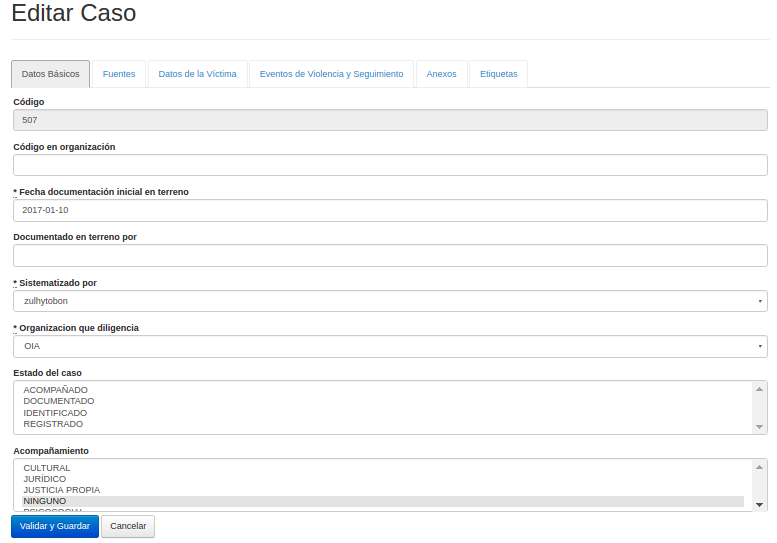
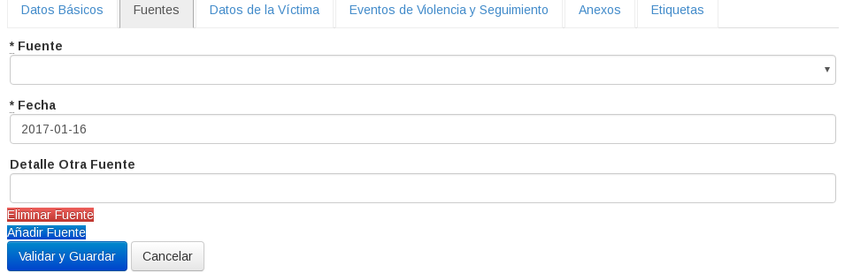
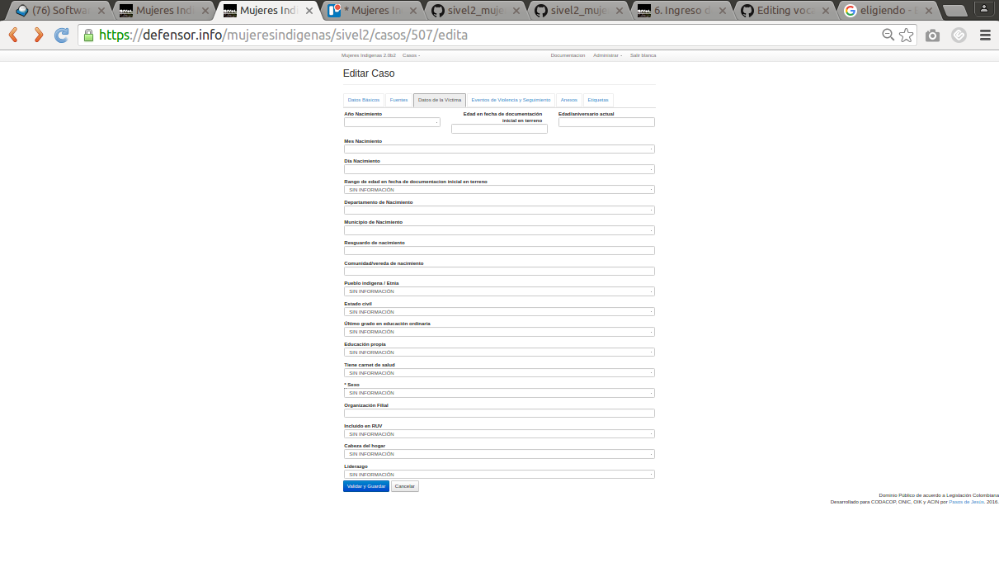
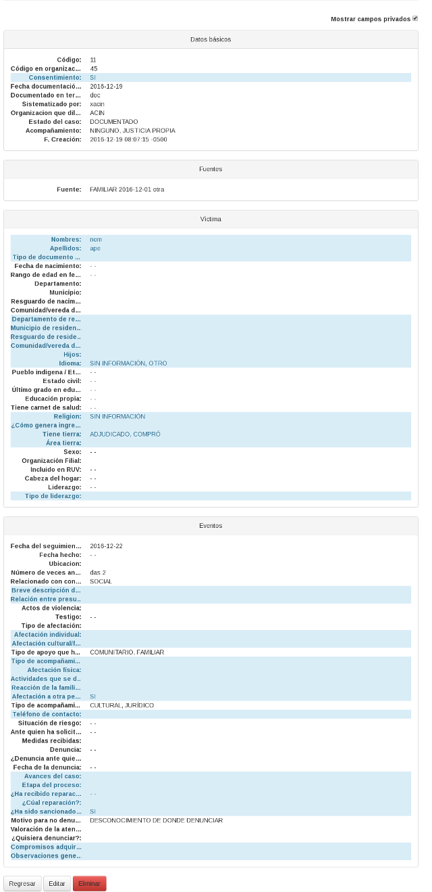
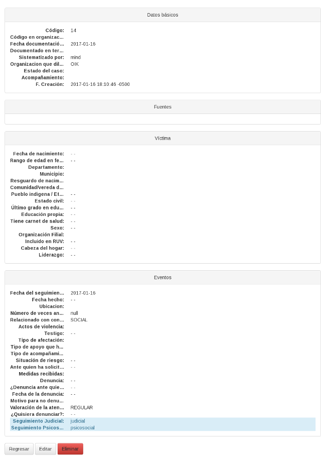

## Ingreso de nuevos casos y actualización  
{#ingreso_de_nuevos_casos_y_actualizacion}
	 
### Ficha Común {#ficha_comun}

En este sistema de información un caso se asocia a una  víctima que acude 
a alguna de las organizaciones del  Observatorio de violencias contra las 
mujeres indígenas, esta víctima puede haber sido agredida en una o en 
varias oportunidades o haber recibido ayudas de las organización 
que documenta en diferentes momentos, pero sigue siendo un mismo caso 
y todo el historial de apoyos y seguimientos institucionales y del 
Observatorio de violencias contra las mujeres indígenas se registran en 
el mismo.

Por esto antes de ingresar un nuevo caso es recomendable que búsque si 
ya está registrado por ejemplo utilizando el listado de casos empleando 
el código, la fecha de documentación (o parte de la misma), el lugar 
en el que ocurrió, el analista que documentó o la organización.

Si está seguro que se trata de un caso nuevo, desde el listado de casos 
presione el botón __Nuevo__. Comience a digitar la información en cada 
una de las pestañas del formulario --notará que el número de caso será 
asignado automáticamente[^ingresos.1].

[^ingresos.1]: La numeración es consecutiva --con saltos cuando se 
  borran casos o se insertan en lote de otro SIVeL. Para efectos 
  de conteos es mejor emplear el listado de casos (ver Sección 2, 
  “Listado de Casos”) o las funcionalidades de conteos.


El sistema guarda con solo cambiar de pestaña así como pulsando
el botón __Validar y Guardar__.  Aunque se sugiere llenar los datos del 
caso en el orden de las pestañas, podrá pasar de una pestaña a otra e 
iniciar en la que prefiera. 
Esto es útil, por ejemplo para iniciar un caso del que acaba de recibir 
información pero que no puede analizar en detalle en el momento, 
pues para crear un caso mínimo basta la fecha de documentación.
Así que si no desea que se actualicen los cambios del caso que edita, 
no presione el botón __Validar y Guardar__, sino devuelvase usando el 
botón del navegador o ubiquese en el espacio con la dirección de la 
página (URL), digite la dirección 
	<https://defensor.info/mujeresindigenas/sivel2> 
y presione ENTER.

Con SIVeL2 puede editar diversos casos simultanemaente abriendo varias 
ventanas o varias pestaña de su navegador.

La interfaz debe mejorarse continuamente, pero se diseñó con el principio 
"primero movil," por lo que resulta posible llenar un caso desde un 
teléfono inteligente o una tableta con poco ancho de pantalla.  
En estos casos es mejor que primero seleccione 
__Administrar->Ficha Vertical__ con lo que el formulario se presentará 
con secciones colapsables verticales en lugar de pestañas horizontales, 
como esa ficha vertical es un diseño adaptativo[^ingresos.2], se ajusta 
automáticamente a tabletas de diferentes dimensiones --puede probarlo 
desde una computador de escritorio al cambiar el tamaño de la ventana 
del navegador para ver como se reorganizan los menús, se escala la
imágen de la pantalla inicial y en general puede llenar un caso.

[^ingresos.2]: En inglés responsive, traducción sugerida en 
  http://words.carlus.cat/como-podemos-traducir-responsive-web-design/.

Cuando presione el botón __Validar y Guardar__ si
el caso es válido se almacenará y será dirigido al resumen 
de ese caso (ver [xref](#resumen_de_un_caso)).

#### Datos Básicos {#datos_basicos}

Entre los datos básicos de un caso es indispensable la fecha de 
documentación inicial del hecho. Si desconoce o no requiere especificar 
otros, en esta y en otras pestañas déjelos en blanco o en cuadros de 
selección en la opción SIN INFORMACIÓN.



* Código: Es asignado automáticamente por el sistema.

* Código en organización: Es el número de orden interno de cada 
  organización.

* Administrador y Organización que diligencia no pueden ser modificados 
  por usuarios con rol de analista.

* Fecha de documentación inicial en terreno:  Sera la fecha de referencia 
  para los datos biográficos de la víctima (como edad, discapacidades, 
  etc).  Si no se conoce con precisión el día se recomienda dejar 15 y 
  agregar etiqueta ```DIA_INEXACTO```.
  Si no se conoce el mes se recomienda dejar Junio y la etiqueta 
  ```MES_INEXACTO```.

* Documentado en terreno por

* Sistematizado por

* Estado del caso: Acompañado, documentado, o registrado.    

* Acompañamiento: Cultural, jurídico, justicia propia, ninguno, 
  psicosocial.

### Fuentes {#fuentes}



* Fuente: familiar, medio de comunicación, otra persona, otro, 
  remisión de otro cabildo, remisión institucional, víctima.

* Fecha

* Detalle Otra Fuente

#### Datos de la Víctima {#datos_de_la_victima}



Se trata de los datos de la persona que ha sido agredida.

La mayoría de cuadros de selección de esta y otras pestañas
pueden configurarse en tablas básicas (ver  [xref](#tablas_basicas)) 
típicamente con el mismo nombre, por ejemplo Rango de Edad, Pueblo 
indígena, Estado civil, Último grado en educación ordinaria.

* Año de nacimiento: Al elegir el año de nacimiento, se completan 
  automáticamente los campos de __Edad en fecha de documentación 
  inicial en terreno__, __Edad aniversario actual__ y __Rango de edad__
* Edad en fecha de documentación inicial en terrerno: Es la cantidad
  de años entre el año de nacimiento y al fecha de documentación. Al 
  escribirla se completan automaticamente el año de nacimiento,
  el otro campo de edad y el __Rango de Edad__.
* Edad/aniversario actual: Es la cantidad de años desde la fecha de 
  nacimiento.  Al escribirla se completan automaticamente el año de 
  nacimiento, el otro campo de edad y el __Rango de Edad__.
* Rango de edad en fecha de documentación inicial en terreno: Es una 
  clasificación para la edad y es útil para conteos. 
  Ejemplo: niñas de 0 a 10 años. Y se completa automáticamente al elegir 
  Año de nacimiento o alguno de los campos de edad.
* Cada sitio geográfico se específica de acuerdo a la división político 
  administrativa de Colombia DIVIPOLA.
* Si entre las opciones que se le presentan no está el que busca puede 
  agregar el departamento, municipio o centro poblado en la tabla básica 
  correspondiente (ver [xref](#tablas_basicas)).
* Departamento: El país es Colombia y se puede elegir uno de sus 
  departamentos (mientras esta información se haya especificado en las 
  respectivas tablas básicas).
* Municipio: Una vez elija el departamento puede elegirse entre sus 
  municipios.
* Resguardo 
* Comunidad/Vereda
* Pueblo indigena / Etnia
* Estado civil
* Último grado en educación ordinaria
* Educación propia
* Tiene carnet de salud
* Sexo
* Organización Filial
* Incluido en RUV: Registro único de víctimas en Colombia.
* Cabeza del hogar
* Liderazgo

#### Eventos de violencia y seguimiento 
{#eventos_de_violencia_y_seguimiento}


Se pueden agregar varios eventos, que quedaran consecutivos uno después 
de otro.  Para agregar se pulsa el boton __Añadir evento__ y después de 
creado si queremos borrarlo se pulsa __Eliminar evento__.

* Fecha del seguimiento
* Año del hecho
* Mes del hecho
* Día del hecho
* Día de la semana
* Departamento
* Municipio
* Resguardo
* Comunidad/vereda
* Número de veces: Cuantas veces fue agredida la víctima antes. Se puede 
  referenciar en números o en letras.
* Relacionado con conflicto: Armado, sin información y social.
* Tabla Grupo Presunto Responsable y Hecho Victimizante:  Un presunto 
  responsable puede ser autor de varias agresiones, a una misma víctima, 
  en un mismo evento.   Esta tabla tiene en cada fila un presunto 
  responsable diferente al de las demás filas y los hechos victimizantes 
  que se le atribuyen.
  Comience por añadir una fila con el botón __Añadir Presunto 
  Responsable__.  Esto abrirá una nueva fila con tres columnas.
  En la columna de la izquierda elija el presunto responsable (se puede 
  elegir   de entre los configurados en la tabla básica Presuntos 
  Responsables, ver [xref](#tablas_basicas)). 
  Luego en la columna central elija un primer hecho victimizante 
  atribuido al presunto responsable de la fila esto creará un botón 
  con el hecho victimizante.  Continúe eligiendo otros hechos 
  victimizantes que le correspondan al mismo presunto responsable.  
  Si necesita borrar un Hecho victimizante pulse la __x__ del botón.
  Si necesita borrar una fila pulse el botón __Eliminar__ de la tercera
  columna.
* Testigo 
* Tipo de afectación: comunitaria, cultural, económica, familiar, física, 
  individual, otra, psicosocial y sin información. 
* Tipo de apoyo: Comunitario, familiar, institución estatal, ONG, 
   organización indígena, otro, sin información.
* Acompañamiento que necesita: Cultural, jurídico, justicia propia, 
  ninguno, sin información.
* Situación de riesgo: No, si, sin información.
* Ante quien ha solicitado medidas: Cabildo, estado, estado y cabildo, 
  ninguno, sin información.
* Medidas recibidas 
* Denuncia: No, si, sin información.
* ¿Denuncia ante quien?: Ambos sistemas, ordinaria, propia, sin 
  información.
* Año denuncia
* Mes denuncia 
* Día denuncia
* Motivo para no denunciar: desconocimiento de donde denunciar, falta de 
  credibilidad en autoridad indígena, falta de credibilidad en entidades 
  estatales, miedo a posibles retaleaciones, no considera que los hechos 
  son violación a sus derechos, otro, prevenir habladuría, sin 
  información, vergüenza
* Valoración de la atención en materia de justicia: sin información, 
  buena, regular, mala.
* ¿Quisiera denunciar?: No, si, sin información.

#### Anexos {#anexos}


Permite anexar archivos. Si se configuró correctamente los archivos 
quedan almacenados en una partición cifrada. Para bajar un articulo de 
prensa en internet, se guarda en el PC en formato PDF y luego se anexa.

* Fecha: Si es un artículo de prensa la fecha será la misma del artículo.
* Descripción: Siempre se debe escribir algún comentario.
* Archivo: Da la opción de descargar el archivo del computador. 

#### Etiquetas {#etiquetas}


 
Permite poner etiquetas con comentarios al caso. Note que debe elegir 
una de las etiquetas (las cuales se especifican en la tabla básica 
Etiqueta), opcionalmente poner un comentario. Es posible cambiar los 
comentarios --por ejemplo si se emplean etiquetas para marcar casos 
que deben revisarse, una vez revisados debe quitarse o cambiarse el 
comentario.

* Fecha
* Usuario: Se refiere al sistematizador.
* Observaciones: Se puede hacer una descripción del porque es importante 
  esta etiqueta, para este caso.
* Etiqueta: Permite hacer énfasis en algo que queremos tener en cuenta 
  especialmente, y también se puede utilizar para hacer conteos.

### Datos privados ACIN {#datos_privados_acin}

Los datos privados de ACIN se verán con un color azul diferente a 
los demás tanto en la ficha como en el resumén.
En el resumén hay un botón en la parte superior derecha para ver o
esconder los campos privados.



#### Datos básicos {#acin_datos_basicos}

* Consentimiento

#### Datos de la víctima {#acin_datos_victima}
* Nombres y Apellidos: Se recomienda escribirlos en mayúsculas y con 
  tildes como aparecen en el documento de identificación principal.
* Tipo de documento de identidad:  Especifique el tipo y el número. 
  Algunos tipos de documentos no se especifican con un número, sino por 
  ejemplo también con letras. 
  En el momento los documentos provisionales deben constar de una letra 
  mayúscula seguida de un guion y un número, mientras que los pasaportes 
  de una letra seguida de un número. El tipo de documento Otros permite 
  letras y números arbitrariamente.
* Departamento de residencia 
* Municipio de residencia 
* Resguardo de residencia 
* Comunidad/Vereda de residencia 
* Hijos: Cantidad
* Idioma: Se puede seleccionar uno o varios idiomas
* ¿Cómo genera ingresos económicos?
* Tiene tierra
* Área tierra
* Tipo de liderazgo 


#### Eventos de violencia y seguimiento {#acin_eventos_de_violencia_y_seguimiento}

* Breve descripción de los hechos
* Relación entre presunto responsable y víctima: abuelo,  amigo, amigo de 
  la familia, esposo, hermano, ninguna, novio, padrastro, padre, primo, 
  tío, vecino
* Afectación individual
* Afectación cultural /familiar /comunitaria
* Afectación física
* Actividades que se dejaron de hacer: Se refiere a la actividad que 
  desempeñaba la víctima en el momento de la agresión.
* Reacción de la familia y la comunidad
* Afectación a otra persona
* Teléfono de contacto
* Avances del caso
* Etapas del proceso
* ¿Ha recibido reparación?
* ¿Cuál reparación?
* ¿Ha sido sancionado el victimario?
* Compromisos ¿Cuales y con quien?
* Observaciones generales

### Datos privados OIK {#datos_privados_oik}

Los datos privados de OIK se verán con un color azul diferente a 
los demás tanto en la ficha como en el resumen.



#### Evento de violencia y seguimiento {#evento_oik}

* Seguimiento jurídico
* Seguimiento psicosocial y cultural
  

