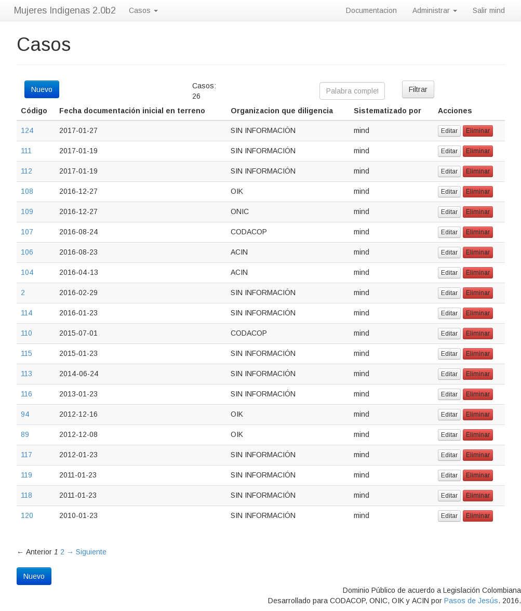
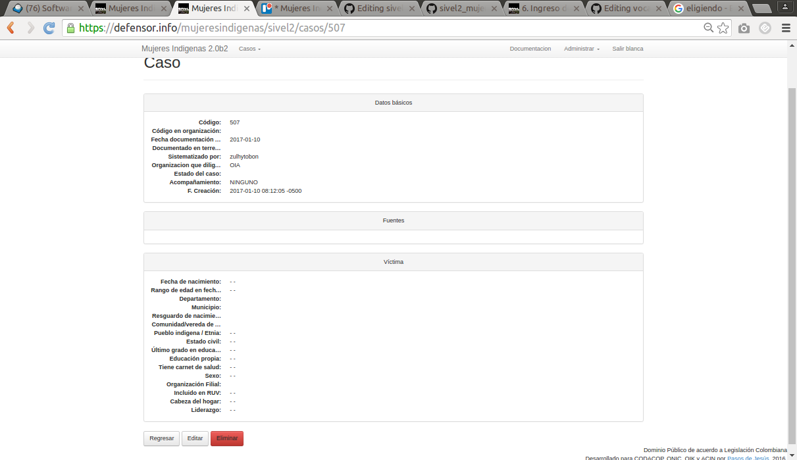

### Listado de Casos  {#listado_de_casos}
 
Al ingresar al menú casos, podrá ver un listado de los casos disponibles, 
notará que este listado se presenta por páginas de 25 casos, en la parte 
inferior encontrará una barra de navegacion que le permite pasar de una 
página a otra.



En la parte superior verá un botón para crear casos nuevos, un conteo de 
los casos listado y una caja de ingreso en la que puede especificar una o 
más palabras que permitén filtrar.

Si teclea una palabra y presiona el botón __Filtrar__ se filtran los casos 
que contenga la palabra en uno de los campos presentados: Código del caso, 
fecha de documentación inicial, organización y usuario.

Podrá editar el caso presionando el botón __Editar__ de la columna 
__Acciones__ y podrá eliminarlo (tras confirmar) con el botón __Eliminar__
de la misma columna.  En el caso de analistas y administradores de oficina 
de una organización podrán efectuar estas operaciones sólo con los casos 
de su organización.

Si conoce el número de caso y tiene permiso para editarlo, podrá editarlo 
empleando un URL de la forma 
```https://defensor.info/mujeresindigenas/casos/3/edita```
pero cambiando ```3``` por la identificación del caso.


#### Resumen de un caso {#resumen_de_un_caso}

Desde el listado de archivo puede examinar el resumen de un caso 
cualquiera (i.e los campos comunes a todas las organizaciones) pulsando 
sobre la identificación del caso (columna **Código**). 




Otra manera si ya conoce la identificación del caso es empleando una URL 
de la forma ```https://defensor.info/mujeresindigenas/casos/3```
pero cambiando ```3``` por la identificación.


