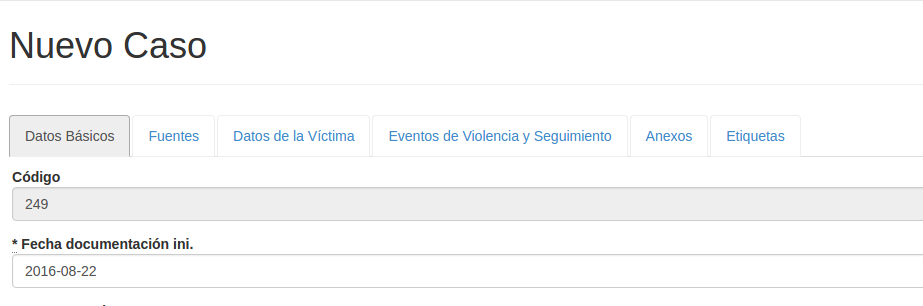
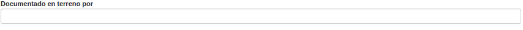
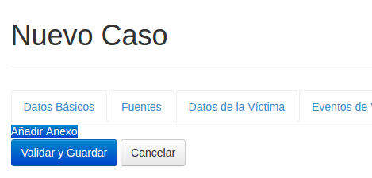
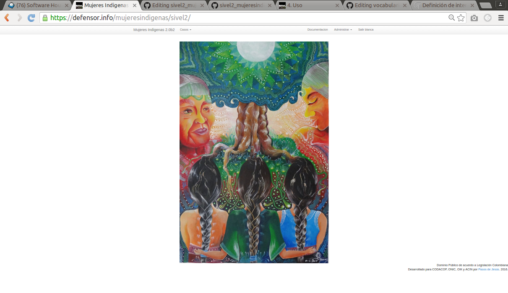

# Uso  {#uso}

**Logros**

* Puede iniciar una sesión y distinguir posibilidad de uso según el rol y según la 
organización.

* Puede buscar casos por código y examinarlos.

* Puede actualizar información de un caso o agregar casos nuevos

* Puede eliminar un caso

SIVeL2 es una aplicación web por lo que se usa con un navegador que soporte 
Javascript. En el momento de este escrito, por economía, seguridad y velocidad 
sugerimos [Chromium](https://www.google.com/chrome/browser/desktop/index.html). 
En cuanto a sistema operativo, como los virus evidencian potenciales huecos de 
seguridad que pueden hacer perder los esfuerzos de seguridad de SIVeL2, 
recomendamos emplearlo desde computadores con OpenBSD/adJ o en su defecto Linux.

### Generalidades sobre la interfaz {#generalidades_interfaz}
Hemos procurado que la operación de SIVeL2 sea simple, basta que tenga en cuenta 
generalidades de la interacción con su navegador y los elementos visuales
de la aplicación por ejemplo:

* Pestañas: Al ver la ficha de un caso en formato horizontal (como se presenta 
por omisión), las pestañas corresponden a secciones de la ficha seleccionables 
con los cuadritos de la parte superior.  Son: Datos básicos, Fuentes, 
Datos de la víctima, Eventos de violencia y Seguimiento, Anexos y Etiquetas.  
Al pulsar sobre cada una para seleccionar una sección cambian de color y se 
despliegan los campos que corresponden a la sección.
 

* Campos: Son cada uno de los espacios para completar información del caso por 
ejemplo en la pestaña Datos básicos Fecha de documentación inicial en terreno, 
Sistematizado por, Organización, etc.  

	* Campos abiertos: Son campos donde se puede escribir cualquier 
	    palabra o número sin restricciones.
	* Campos cerrados: Son campos donde se puede escoger una o varias 
  	  de las opciones ya establecidas puede ser por una tabla básica.
	  Pueden ser de dos tipos:
		* Campo de selección única: Los identifica porque tienen al 
		  lado derecho una pequeña flecha. Al pulsar en un campo de 
		  selección única se despliega una lista de opciones y sólo 
	 	  permite elegir una.  
	 	  
		  En este tipo de campos selección para elegir más rápido 
		  una opción podrá comenzar a escribir la palabra con la 
	  	  que comienza.
		* Campos de selección múltiple: permiten 
	 	  seleccionar/deseleccionar varias opciones. Para hacerlo 
		  presione la tecla **Control** mientras pulsa el botón 
		  izquierdo del ratón.
		  
		  
	
* Botones: Son cajas de color (típicamente azul, gris  o rojo) con un texto 
que describe la acción que realiza, al colocar el puntero del ratón sobre ellos 
aparece una manita indicando que al pulsar se realiza la acción. En el
ejemplo siguiente son botones los marcados con "Validar y Guardar",  
"Cancelar".

### Inicio de una sesión y autenticación {#inicio_de_una_sesion_y_autenticacion}

Desde un computador seguro (preferiblemente con OpenBSD o Ubuntu) ingrese a su 
navegador y en la barra de direcciones digite: 
<https://defensor.info/mujeresindigenas/sivel2/>

	
**Aviso**

* Note que el URL comienza con *https* es decir se transmite información del servidor 
a su computador con el protocolo del web típico (HTTP) pero con cifrado fuerte SSL. 
Este cifrado requiere que el servidor web tenga un certificado (como efectivamente
ocurre en el caso de defensor.info).

Para iniciar una sesión debe ingresar su nombre de usuario y su clave (que debió 
ser creada por un usuario con rol administrador).

	
**Aviso**

* SIVeL2 no almacena su clave directamente sino una especie de huella digital de la 
misma (condensado bcrypt). Por esto en el caso de SIVeL puede emplear la clave que 
prefiera con la confianza que no podrá ser conocida por administradores que tengan acceso a la base. 
Se recomienda que tenga números, letras y caracteres especiales. 
Es conveniente cambiarla periódicamente, puede hacerlo desde Administración->Clave.
Si otros sitios donde emplea claves no le garantizan esto mismo, por favor emplee una
clave diferente.

Una vez autenticado verá el menú principal.

Dependiendo del rol de su usuario (ver Sección 2, “Recurso Humano”) tendrá o no 
tendrá acceso a las opciones del menú: Por ejemplo una persona con rol analista no 
tendrá acceso al menú Administración->Usuarios. --que si puede ser usado por
quien tenga rol administrador o administrador de oficina.

